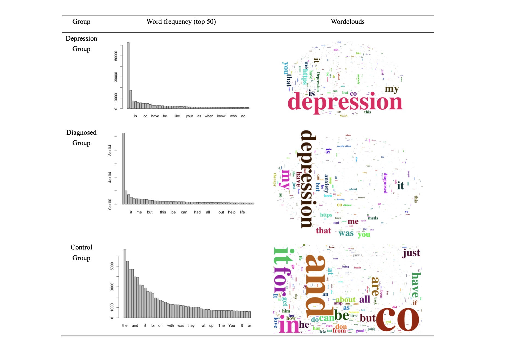

```{r, include = FALSE}
library(knitr)
library(tidyverse)
library(rtweet)
library(twitteR)
library(syuzhet)
library(tm)
library(SnowballC)
library(tidytext)
library(ggmap)
library(dplyr)
library(ggplot2)
library(lubridate)
library(wordcloud2)
library(jiebaR)
library(jiebaRD)
library(vcd)
library(ggpubr)
library(rowr)
library(readr)
library(stringr)
library(DT)
```

## Abstract

xxx

## Introduction

### Research background

Depressive disorders have become an increasingly serious and public mental health issue around the world. Among all the public health problems, the depression is more easily leading to suicide globally, which constitutes a huge challenge for public health. However, relevant research is mainly conducted with experimental psychological data, large-scale available quantifiable preliminary data is insufficient for study. To obtain preliminary data, social media is a perfect fit for studying mental health in both individual and overall trends in the population, because people are increasingly likely to post feelings and thoughts with the others, expressing DEPRESSED EMOTION on social media meanwhile, while their expressive behavior is different to each other. Thus, language use, social expression and their interaction are uncovering indicators of mental health. Recently, there appears to be numerous studies using social media, especially twitter data to investigate people’s emotions and political opinions, as well as predicting the future trends.

### Literature review

Depression has become a major public health problem around the world. According to  the World Health Organization (WHO), depression is a common mental disorder. Globally, more than 264 million people of all ages suffer from depression [@CDC2008]. Depression is a leading cause of disability worldwide and is a major contributor to the overall global burden of disease, which is believed to be responsible for the more than 30,000 suicides each year [@Luoma2002]. It involves repeated depressive period, during which person will experience depressed mood, loss of interest and enjoyment, and reduced energy leading to diminished activity. However, there is a problem of insufficient diagnosis and treatment for depression. It can be hard to accurately diagnose depression because it can look so different from person to person [@Smith2013]. More important, several researches have found that a good portion of people with mental disorder is not getting help. Olfson, Blanco and Marcus (2016) screened more than 46000 adults for depression and found that 8.4% have a positive test results for depression. However, only less than 30% of the study participants with depression actually sought treatment.

According to a survey from the High Watch Recovery Center, there are several reasons for people who need help for a mental health issue but don’t seek it. First, people  may be afraid of being stigmatized. Second, people may not realize that they do need assistances  from professionals. Furthermore, people’s circumstances and some practical issues may prevent them from seeking help. For example, economic level, geographic location, availability of psychologists, etc. Also, there is a probability that people just are scared of the treatment or therapy, misleading by disturbing conceptions such as the old-fashioned lobotomies or electroconvulsive therapy. In general, depression as a serious mental health issue has become prevalent in recent years while lack of efficient methods to detect depression.

In the context of all the challenges, social media has become a potential source to detect people’s behavior and mental process. People are increasingly using social media platforms like Twitter, Facebook and Instagram to express their thoughts and share their opinions with contacts. Peoples’ tweets can be considered as their true emotions and feelings in naturalistic settings, recording their real-time daily activities and happenings [@Choudhury2013]. On contrary to traditional subjective self-reporting measures, large-scale and fine-grained records of users’ activities in social media allow researchers using objective information to recognize depression [@Tsugawa2015]. 

Although there might be social desirability in the circumstance since social media is a public platform that everyone can see the contents. However, we can still consider social media as a reliable method for capturing the thoughts, mood, communication and socialization of individuals. The languages in social media postings may indicate feelings of worthlessness, guilt, helplessness, and self-hatred that characterize depression as manifested in our daily life [@MChoudhury2013]. Additionally, the etiology of depression typically includes social environmental factors [@Rosenquist2011]. Capturing the depression sufferers’ social context in a manner that might help detect depression in populations. Park et al. (2012) provided initial evidence that twitter users do expose their depression and even their therapy and treatment of depression in tweets [@Park2012]. It is also  possible that identifying depression by analyzing textual data from sentences written by the individuals [@Resnik2013]. Meanwhile, researchers evaluated the effectiveness of using social media activities data to estimate the degree of depression and found that features obtained from user activities can be used to predict depression with an accuracy of 69% [@Tsugawa2015]. All those works highlighted the potential of social media, especially Twitter as an effective source of signals to analyze or even predict current or future episodes of depression. 

However, there is few previous researches use large-scale Twitter data, only focusing on small samples. Meanwhile, previous research did not analyze the attributes of depressed individual, especially their activities on Twitter. Most importantly, previous studies did not group participants entering the research to control the features obtained from on-line activities of the participants, so it was unable to compare and obtain causality between groups. Thus, in this paper:

- We conducted a quasi-experiemnt, which can also be stated as field-test, divided the participants into three groups and investigated their differences in activities on the Twitter platform. 

- Furthermore, we analyzed the texts of different groups of participants, exploring the content as well as sentiments of the individuals. 

- Finally, we tried to investigate some relationships between features of Twitter users and their sentimental performances. 

### Hypotheses

#### Sentiment analysis (between group)

- Hypothesis 1a: Depression group and diagnosed group have fewer positive sentiments than control group.

- Hypothesis 1b: Depression group and diagnosed group have more negative sentiments than control group.

#### User features & sentiment scores (within group)

- Hypothesis 2a: The more followers the user has, the lower negative and higher positive scores the user has.

- Hypothesis 2b: The more friends the user has, the lower negative and higher positive scores the user has.


## Method

### Data sources

In this study, we collected data directly from Twitter. All data we obtain is public, posted between December 1st to December 8th in 2019, and made available from Twitter via their application programming interface (API). Specifically, it does not include any data that language is not English. All the tweets we collected are original posts, in other words, are not retweets. Tweets texts that contain hashtags and uniform resource locator are also excluded from our data. 

```{r, eval = FALSE}
create_token(
  app = "Data Display Social Research",
  consumer_key = "kSGIiodRghgYq289SZBRP5hlO",
  consumer_secret = "jFLbGoOsgxuhon4YLX51Lb5Q79EgIwjjJSVYu3SZEa6x7EkLl2",
  access_token = "1181245045287948288-tjS90xmIaMmRsAAEaCDUuM8jkhlbE9",
  access_secret = "4K45yuHd4gSXZXMeRu11Tp8SsYda7NXzzYKSC41XjDw12"
)

create_token(
  app = "Data Display Social Research",
  consumer_key = "3RdnGQ0hETW7LHbQdZtI14VRD",
  consumer_secret = "0mxU7gGQSgSF2NgYJVuCC9au026ut5ncUJLr13ppU8Unw9a2Qx",
  access_token = "1181245045287948288-WkVfbTxp82YMBP64F5GjH6oyt9Ux8d",
  access_secret = "gWOYYYVyv7BzUhYSy8p4a3HXw5MPGi8RxUi30qciaQdEf"
)

get_token()
```

### Data collection

We collected three groups of data separately. The first group is general “Depression Group”,  which is the individuals whose tweets text contained the word “depression”. We first search the latest 18k English tweets including the keyword “depression” several times in one-week window, combine them into a dataset and delete observations that duplicated in every column. Then we set a random sampling to select 20k observations as  group 1. 

```{r, eval = FALSE}
dp1 <- search_tweets("depression", lang = "en", include_rts = FALSE, n = 18000)
dp1 <- subset(dp1, is.na(dp1$hashtags))
dp1 <- subset(dp1, is.na(dp1$url))
dp1 <- dp1 %>%
  select (user_id, created_at, text, source, display_text_width, location, 
          followers_count, friends_count, listed_count, statuses_count, 
          favourites_count, account_created_at)
dp1 <- as.data.frame(dp1)
save_as_csv(dp1, "dp1-Date-Time.csv")
```

Then, in order to build models to validate the “Depression Group”, we need a sample of the general population to use as an approximation of community controls, the “Control Group”. We follow a similar process: randomly select English tweets several times in one-week window, combine them into a dataset, delete duplicated observations and set a random sampling to select 20k observations as group 2. We make no attempt to remove “depression” or “diagnosed depression” individuals in the control group, since we assume that the prevalence of depression in the general population is similar in our control groups. From this perspective, the control group is representative.

```{r, eval = FALSE}
dp2 <- search_tweets(" ", lang = "en",include_rts = FALSE, n = 18000)
dp2 <- subset(dp2, is.na(dp2$hashtags))
dp2 <- subset(dp2, is.na(dp2$url))
dp2 <- dp2 %>%
  select (user_id, created_at, text, source, display_text_width, location, 
          followers_count, friends_count, listed_count, statuses_count, 
          favourites_count, account_created_at)
dp2 <- as.data.frame(dp2)
save_as_csv(dp2, "dp2-Date-Time.csv")
```

Meanwhile, we seek users who publicly state that they have been diagnosed with depression. Table below shows examples of statements of diagnosis. The terms and phrases used for searching for depression diagnosis tweets are the same as the prior research conducted by Nambisan et al. (2015), which already been confirmed that could use to recognize diagnosed depression. We search for each combination of terms and phrases separately and then deal with the data as the first and second group. As a result, we get 20k observations as “Diagnosed Group”, which is group 3. It should be noticed that the method we use can not verify whether this diagnosis is genuine. However, given the stigma often associated with mental illness, the probability that individual report they are diagnosed with a condition they do not have is low.

| No. | Diagnosis related terms |
| ---------- | ---------------- |
| 1 |  I AND diagnosed AND depression |
| 2 |  I am suffering AND depression |
| 3 |  I AND depression meds |
| 4 |  I AND medication AND depression |
| 5 |  I AND have AND depression AND meds |
| 6 |  I AND take AND depression meds |
| 7 |  I AND Prozac AND depressed |
| 8 |  I AND Prozac AND depression |
| 9 |  I AND taking depression meds |
| 10 |  I AND therapy AND depression |
| 11 |  I battling AND depression |
| 12 |  I AND clinical AND depression |
| 13 |  I AND living with depression |
| 14 |  How to tell AND depression |

Table: Terms & phrases used for searching for depression diagnosis tweets

```{r, eval = FALSE, tidy = TRUE, }
dp3a <- search_tweets(q = "I AND diagnosed AND depression", lang = "en", 
                      include_rts = FALSE, n = 1000)
dp3b <- search_tweets(q = "I am suffering AND depression", lang = "en", 
                      include_rts = FALSE, n = 1000)
dp3c <- search_tweets(q = "I AND depression meds", lang = "en",
                      include_rts = FALSE, n = 1000)
dp3d <- search_tweets(q = "I AND medication AND depression", lang = "en",
                      include_rts = FALSE, n = 1000)
dp3e <- search_tweets(q = "I AND have AND depression AND meds", lang = "en",
                      include_rts = FALSE, n = 1000)
dp3f <- search_tweets(q = "I AND take AND depression meds", lang = "en",
                      include_rts = FALSE, n = 1000)
dp3g <- search_tweets(q = "I AND Prozac AND depressed", lang = "en",
                      include_rts = FALSE, n = 1000)
dp3h <- search_tweets(q = "I AND Prozac AND deprssion", lang = "en",
                      include_rts = FALSE, n = 1000)
dp3i <- search_tweets(q = "I AND taking depression meds", lang = "en",
                      include_rts = FALSE, n = 1000)
dp3j <- search_tweets(q = "I AND therapy AND depression", lang = "en",
                      include_rts = FALSE, n = 1000)
dp3k <- search_tweets(q = "I battling AND depression", lang = "en",
                      include_rts = FALSE, n = 1000)
dp3l <- search_tweets(q = "I AND clinical AND depression", lang = "en",
                      include_rts = FALSE, n = 1000)
dp3m <- search_tweets(q = "I AND living with depression", lang = "en",
                      include_rts = FALSE, n = 1000)
dp3n <- search_tweets(q = "How to tell AND depression", lang = "en",
                      include_rts = FALSE, n = 1000)
dp3 <- rbind(dp3a, dp3b, dp3c, dp3d, dp3e, dp3f, dp3g, 
             dp3h, dp3i, dp3j, dp3k, dp3l, dp3m, dp3n)
dp3 <- data.frame(dp3)
dp3 <- subset(dp3, is.na(dp3$hashtags))
dp3 <- subset(dp3, is.na(dp3$url))
dp3 <- dp3 %>%
  select (user_id, created_at, text, source, display_text_width, location,
          followers_count, friends_count, listed_count, statuses_count, 
          favourites_count, account_created_at)
save_as_csv(dp3, "dp3-Date-Time.csv")
```

```{r, echo = FALSE}
# Data cleaning process

# import data to excel format
dp1_1 <- read.csv("dp1-1.csv")
dp1_2 <- read.csv("dp1-2.csv")
dp1_3 <- read.csv("dp1-3.csv")
dp1_4 <- read.csv("dp1-4.csv")
dp1_5 <- read.csv("dp1-5.csv")

dp2_1 <- read.csv("dp2-1.csv")
dp2_2 <- read.csv("dp2-2.csv")
dp2_3 <- read.csv("dp2-3.csv")
dp2_4 <- read.csv("dp2-4.csv")
dp2_5 <- read.csv("dp2-5.csv")

dp3_1 <- read.csv("dp3-1.csv")
dp3_2 <- read.csv("dp3-2.csv")
dp3_3 <- read.csv("dp3-3.csv")
dp3_4 <- read.csv("dp3-4.csv")
dp3_5 <- read.csv("dp3-5.csv")
dp3_6 <- read.csv("dp3-6.csv")
dp3_7 <- read.csv("dp3-7.csv")
dp3_8 <- read.csv("dp3-8.csv")
dp3_9 <- read.csv("dp3-9.csv")
dp3_10 <- read.csv("dp3-10.csv")
dp3_11 <- read.csv("dp3-11.csv")
dp3_12 <- read.csv("dp3-12.csv")
dp3_13 <- read.csv("dp3-13.csv")
dp3_14 <- read.csv("dp3-14.csv")
dp3_15 <- read.csv("dp3-15.csv")
dp3_16 <- read.csv("dp3-16.csv")
dp3_17 <- read.csv("dp3-17.csv")
dp3_18 <- read.csv("dp3-18.csv")
dp3_19 <- read.csv("dp3-19.csv")
dp3_20 <- read.csv("dp3-20.csv")
dp3_21 <- read.csv("dp3-21.csv")
```

```{r, echo = FALSE}
# Conbine data set
dp1 <- rbind(dp1_1, dp1_2, dp1_3, dp1_4, dp1_5)
dp2 <- rbind(dp2_1, dp2_2, dp2_3, dp2_4, dp2_5)
dp3 <- rbind(dp3_1, dp3_2, dp3_3, dp3_4, dp3_5, dp3_6, dp3_7,
dp3_8, dp3_9, dp3_10, dp3_11, dp3_12, dp3_13, dp3_14, dp3_15,
dp3_16, dp3_17, dp3_18, dp3_19, dp3_20, dp3_21)
```

```{r, echo = FALSE}
# Delete duplicate data
dp1 <- dp1[!duplicated(dp1),]
dp2 <- dp2[!duplicated(dp2),] 
dp3 <- dp3[!duplicated(dp3),]
```

```{r, echo = FALSE}
# Random sample, 20000 for each group
dp1 <- dp1[sample(nrow(dp1), 20000), ]
dp2 <- dp2[sample(nrow(dp2), 20000), ]
dp3 <- dp3[sample(nrow(dp3), 20000), ]
```

The primary data we collect includes a variety of features of users’ tweets. The essential variables we focus on are: text (content of this tweet), source (tweeting client), created_at (the UTC DateTime that this tweet was created), followers_count (the number of followers this account currently has), friends_count (the number of users this account is following), listed_count (the number of public lists that this user is a member of), statuses_count (the number of tweets including retweets issued by the user), favourites_count (the number of tweets this user has liked in the account’s lifetime). The other variables are user_id (the unique identifier for this user), display_text_width (the number of characters displayed of this tweet), location (the user-defined location for this account’s profile), account_created_at (the UTC DateTime that the user account was created).

## Results

### Data exploration

#### Word clouds

First we calculate the vocabulary frequency and create word could for each group. Word clouds are graphical representations of word frequency that give greater prominence to words that appear more frequently in the source text. In our graph, the larger the word in the visual the more common the word was in the Twitter posts. In order to present the texts better, we set up the common prepositions as stop words, which will not be presented in the word clouds. 

From figure below we can see that in both “Depression Group” and “Diagnosed Group”, the most common words are “depression”. It is obvious since we extract the group through the word “depression”. Another word which is distinct in the figure is “anxiety”. In fact, many researches proved that there is a high probability that depression accompanied by anxiety. Our findings confirm this theory to some extent. In addition, first-person singular possessive determiners such as “my”, “me” are also very obvious in the graphs of “Depression Group” and “Diagnosed Group”. We could assume that the subject of the word “depression” might be "I", which is the result we expected. For the control group, we do not find obvious differences among different words, which means that this group is an appropriate control group without any tendency. 



```{r, eval = FALSE}
# Create wordclouds for each group
# Group 1
dp1_text <- as.character(dp1$text)
seg <- qseg[dp1_text] # use seg to cut vocabulary
seg <- seg[nchar(seg)>1] # delete words that less than 1 unit
seg
# Set stopwords
all_stops <- c("and","of","http","to","for","in","on","the","with","at","or","from")
seg <- removeWords(seg, all_stops)
seg <- table(seg)
seg_50 <- sort(seg, decreasing = TRUE)[1:50]
# get word frequency (top 50)
seg_50
barplot(seg_50)
wordcloud2(seg,size = 2, minRotation = -pi/2, maxRotation = -pi/2) # Create wordcloud

# Group 2
dp2_text <- as.character(dp2$text)
seg <- qseg[dp2_text] # use seg to cut vocabulary
seg <- seg[nchar(seg)>1] # delete words that less than 1 unit
seg

seg <- table(seg)
seg_50 <- sort(seg, decreasing = TRUE)[1:50]
# get word frequency (top 50)
seg_50
barplot(seg_50)
wordcloud2(seg,size = 2, minRotation = -pi/2, maxRotation = -pi/2) # Create wordcloud

# Group 3
dp3_text <- as.character(dp3$text)
seg <- qseg[dp3_text] # use seg to cut vocabulary
seg <- seg[nchar(seg)>1] # delete words that less than 1 unit
seg
# Set stopwords
all_stops <- c("and","of","http","to","for","in","on","the","with","at","or","from")
seg <- removeWords(seg, all_stops)
seg <- table(seg)
seg_50 <- sort(seg, decreasing = TRUE)[1:50]
# get word frequency (top 50)
seg_50
barplot(seg_50)
wordcloud2(seg,size = 2, minRotation = -pi/2, maxRotation = -pi/2) # Create wordcloud
```

#### Descriptive analysis

To investigate twitter user’s online activities, we select five key variables as user features from tweets data for preliminary descriptive analysis: source is a categorical variable, and followers count, friends count, statuses count, and favourites count are continuous variables. Before conducting descriptive analysis, we identify potential outliers or influential observations of user features variables through histogram and boxplot and find that all the four distributions are asymmetric and highly right-skewed. To reduce the effect brought by extreme values on data for further analysis, we use median to replace the outliers those are larger than upper quantile plus 1.5 times upper quantile minus lower quantile instead of mean, because mean is already influenced by outliers largely.

|   | Min             ||| Max            |||
| ------ | ------ | ------ | ------ | ------ | ------ | ------ |
|   | G1 | G2 | G3 | G1 | G2 | G3 | 
| followers_count | 0.00 | 0.00 | 0.00 | 1918.00 | 1919.00 | 1918.00 | 
| friends_count | 0.00 | 0.00 | 0.00 | 1783.00 | 1783.00 | 1778.00 | 
| statuses_count | 1.00 | 0.00 | 1.00 | 50010.00 | 50087.00 | 49811.00 |
| favourites_count | 0.00 | 0.00 | 0.00 | 54301.00 | 54451.00| 54425.00 | 

| Median      ||| Mean          ||| Std.dev.      |||
| ------ | ------ | ------ | ------ | ------ | ------ | ------ | ------ | ------ |
| G1 | G2 | G3 | G1 | G2 | G3 | G1 | G2 | G3 |
| 235.00 | 269.00 | 276.00 | 347.53 | 368.95 | 398.17| 393.03 | 412.66 | 418.62 |
| 306.00 | 339.00 | 351.00 | 391.02 | 411.19 | 451.61 | 358.70 | 374.82 | 372.58 |
| 5645.50 | 5950.00 | 6171.00 | 8944.12 | 9012.25 | 9956.50 | 10948.09 | 10996.06 | 11216.09 |
| 5881.50 | 5238.00 | 6861.00 | 9912.68 | 9365.84 | 12143.14 | 12094.38 | 11861.43 | 12884.63 |

Table:  Basic statistics about activities of tweeter user

```{r, include = FALSE}
# merge different groups, add group as a variable
group_1 <- rep(1, times = nrow(dp1))
dp1$group <- group_1
group_2 <- rep(2, times = nrow(dp2))
dp2$group <- group_2
group_3 <- rep(3, times = nrow(dp3))
dp3$group <- group_3

dp_all <- bind_rows(dp1,dp2,dp3)
dp_all$group = factor (dp_all$group, levels = c(1,2,3), labels = c("depression group", "control group", "diagnosed group"))
head(dp_all)
```

```{r, include = FALSE}
# check distributions of followers_count, friends_count, listed_count, statuses_count, favourites_count和sentiment_score

# replace outliers with median (followers_count)
dp_all %>%
  ggplot(mapping = aes(x = '', y = followers_count)) + 
  geom_boxplot(outlier.colour = 'red', outlier.shape = 15, width = 1.2)
QL1 <- quantile(dp_all$followers_count, probs = 0.25) 
QU1 <- quantile(dp_all$followers_count, probs = 0.75) 
QU1_QL1 <- QU1 - QL1
QL1;QU1_QL1;QU1
which(dp_all$followers_count > QU1 + 1.5*QU1_QL1)
dp_all$followers_count[which(dp_all$followers_count > QU1 + 1.5*QU1_QL1)]

out_imp01 <- median(dp_all$followers_count)
dp_all$followers_count[which(dp_all$followers_count > QU1 + 1.5*QU1_QL1)] <- out_imp01
qqnorm(dp_all$followers_count, ylab = "Number of followers") 
qqline(dp_all$followers_count)
# hist distribution
hist(dp_all$followers_count)

# replace outliers with median (friends_count)
dp_all %>%
  ggplot(mapping = aes(x = '', y = friends_count)) + 
  geom_boxplot(outlier.colour = 'red', outlier.shape = 15, width = 1.2)
QL2 <- quantile(dp_all$friends_count, probs = 0.25) 
QU2 <- quantile(dp_all$friends_count, probs = 0.75) 
QU2_QL2 <- QU2 - QL2
QL2;QU2_QL2;QU2
which(dp_all$friends_count > QU2 + 1.5*QU2_QL2)
dp_all$friends_count[which(dp_all$friends_count > QU2 + 1.5*QU2_QL2)]

out_imp02 <- median(dp_all$friends_count)
dp_all$friends_count[which(dp_all$friends_count > QU2 + 1.5*QU2_QL2)] <- out_imp02
qqnorm(dp_all$friends_count, ylab = "Number of friends") 
qqline(dp_all$friends_count)
# hist distribution
hist(dp_all$friends_count)

# replace outliers with median (statuses_count)
dp_all %>%
  ggplot(mapping = aes(x = '', y = statuses_count)) + 
  geom_boxplot(outlier.colour = 'red', outlier.shape = 15, width = 1.2)
QL3 <- quantile(dp_all$statuses_count, probs = 0.25) 
QU3 <- quantile(dp_all$statuses_count, probs = 0.75) 
QU3_QL3 <- QU3 - QL3
QL3;QU3_QL3;QU3
which(dp_all$statuses_count > QU3 + 1.5*QU3_QL3)
dp_all$statuses_count[which(dp_all$statuses_count > QU3 + 1.5*QU3_QL3)]

out_imp03 <- median(dp_all$statuses_count)
dp_all$statuses_count[which(dp_all$statuses_count > QU3 + 1.5*QU3_QL3)] <- out_imp03
qqnorm(dp_all$statuses_count, ylab = "Number of statuses") 
qqline(dp_all$statuses_count)
# hist distribution
hist(dp_all$statuses_count)

# replace outliers with median (以favourites_count为例)
dp_all %>%
  ggplot(mapping = aes(x = '', y = favourites_count)) + 
  geom_boxplot(outlier.colour = 'red', outlier.shape = 15, width = 1.2)
QL4 <- quantile(dp_all$favourites_count, probs = 0.25) 
QU4 <- quantile(dp_all$favourites_count, probs = 0.75) 
QU4_QL4 <- QU4 - QL4
QL4;QU4_QL4;QU4
which(dp_all$favourites_count > QU4 + 1.5*QU4_QL4)
dp_all$favourites_count[which(dp_all$favourites_count > QU4 + 1.5*QU4_QL4)]

out_imp04 <- median(dp_all$favourites_count)
dp_all$favourites_count[which(dp_all$favourites_count > QU4 + 1.5*QU4_QL4)] <- out_imp04
qqnorm(dp_all$favourites_count, ylab = "Number of favourites") 
qqline(dp_all$favourites_count)
# hist distribution
hist(dp_all$favourites_count)
```

#### User features between different groups

```{r, include = FALSE}
# Descriptive statistics 
summary(dp_all)
dp_agg <- dp_all %>%
  select(followers_count, friends_count, statuses_count, favourites_count, group) 
dp_stats <- aggregate(dp_agg[,(1:4)], by = list(dp_agg$group), FUN = mean)
colnames(dp_stats)[1] <- "group"
dp_stats

dp_all %>% # followers_count
  group_by(group) %>%
  summarise(min = min(followers_count), max = max(followers_count), median = median(followers_count), mean = mean(followers_count), sd = sd(followers_count))

dp_all %>% # friends_count
  group_by(group) %>%
  summarise(min = min(friends_count), max = max(friends_count), median = median(friends_count), mean = mean(friends_count), sd = sd(friends_count))
 
dp_all %>% # statuses_count
  group_by(group) %>%
  summarise(min = min(statuses_count), max = max(statuses_count), median = median(statuses_count), mean = mean(statuses_count), sd = sd(statuses_count))

dp_all %>% # favourites_count
  group_by(group) %>%
  summarise(min = min(favourites_count), max = max(favourites_count), median = median(favourites_count), mean = mean(favourites_count), sd = sd(favourites_count))
```


```{r, include = FALSE}
# plot user features distribution  
ggplot(mapping = aes(dp_all$followers_count)) + geom_histogram(bins = 100)
ggplot(mapping = aes(dp_all$friends_count)) + geom_histogram(bins = 100)
ggplot(mapping = aes(dp_all$statuses_count)) + geom_histogram(bins = 100)
ggplot(mapping = aes(dp_all$favourites_count)) + geom_histogram(bins = 100)
```

```{r, echo = FALSE, message = FALSE, fig.align = "center", fig.cap = "Feature means: Comparison between groups", out.width = "55%"}
# plot means of user features among 3 groups
p1 <- ggplot(data = dp_stats, aes(y = followers_count, x = group, fill = group, xlab = "")) +
  geom_bar(stat="identity") +
  theme_classic() +
  scale_x_discrete(labels = abbreviate)
p2 <- ggplot(data = dp_stats, aes(y = friends_count, x = group, fill = group, xlab = "")) +
  geom_bar(stat="identity") +
  theme_classic() +
  scale_x_discrete(labels = abbreviate)
p3 <- ggplot(data = dp_stats, aes(y = statuses_count, x = group, fill = group, xlab = "")) +
  geom_bar(stat="identity") +
  theme_classic() +
  scale_x_discrete(labels = abbreviate)
p4 <- ggplot(data = dp_stats, aes(y = favourites_count, x = group, fill = group, xlab = "")) +
  geom_bar(stat="identity") +
  theme_classic() +
  scale_x_discrete(labels = abbreviate)
ggarrange(p1,p2,p3,p4, ncol=2,nrow=2,labels=c("A","B","C","D"))
```

```{r, echo = FALSE, message = FALSE, fig.align = "center", fig.cap = "Distribution of tweeting sources", out.width = "55%"}  
# Descriptive statistics (categorical source)
dp_all %>%
  group_by(source) %>%
  summarise(total = n()) %>%
  filter(source == "Facebook"|source == "Instagram"|source == "Tweetbot for iOS"|source == "TweetDeck"|source == "twittbot.net"|source == "Twitter for Android"|source == "Twitter for iPad"|source == "Twitter for iPhone"|source == "Twitter Web App"|source == "Twitter Web Client") %>%
  ggplot() +
  geom_bar(mapping = aes(x = reorder(source, total), y = total), stat = 'identity', fill = 'skyblue2') +
  coord_flip()
```
#### Tweets time distribution between depression group and diagnosed group

To probe how the tweets representing depression are distributed during 24 hours over an entire day, we extract the rounded hour of every tweet issued and calculate the total number of tweets within a certain hour. The figure shows that the tweets of depression group centralize around 01:00 at late night, with high frequencies from 01:00 to 03:00. This is probably because depression symptoms tend to worsen during the nights, also due to the posting patterns that people are generally willing to use social media after the end of workday. Limited by the tweets of control group not covering 24 hours over the entire day, we only focus on the difference between distributions of depression group and diagnosed group. From Figure below, we observe that evenings and early nights show peak, which is same as the figure. Line A displays that the tweets of diagnosed group centralize around 20:00 at night. Line B shows how the mean of tweets of depression group and diagnosed group changes over one day. We can still find a diurnal posting pattern with lower activity through daytime and high activity after 00:00 at late night. Also, by comparing the ranges of two figures, we observe that the number of tweets at every hour in diagnosed group (70% more) has a larger range than depression group (66% more).

```{r, include = FALSE}
# Set date format
dp_all$date <- as.Date(dp_all$created_at)
# Set time format
dp_all$time <- ymd_hms(dp_all$created_at)
```

```{r, echo = FALSE, message = FALSE, fig.align = "center", fig.cap = "Distribution of depression group and diagnosed group tweets in 24 hours", out.width = "55%"}
# Time analysis
# Extract date to cover the NA
dp_all$date <- as.Date(dp_all$time)
# Create new time variables: roundhour, hour, roundmin, minute
ymd(19970316); myd(03199716); dmy(16031997)
test_date <- ymd_hms("1997-03-16 12:01:30")
dp_all$roundhour <- round_date(dp_all$time, 'hour')
dp_all$roundmin <- round_date(dp_all$time, "minute")
dp_all$hour <- hour(dp_all$roundhour)
dp_all$minute <- minute(dp_all$roundmin)
# Graph twitter counts in 24 hours
dp_all %>%
  group_by(group, hour) %>%
  summarise(total = n()) %>%
  filter(group == "depression group" | group == "diagnosed group") %>%
  ggplot() +
  geom_bar(mapping = aes(x = hour, y = total, fill = group), stat = "identity")+
  geom_line(mapping = aes(x = hour, y = total, fill = group), colour = "navy") +
  theme_classic() 
```

```{r, echo = FALSE, message = FALSE, fig.align = "center", fig.cap = "Distribution of depression group tweets in 24 hours", out.width = "55%"}
# Focus on group 3
dp_all %>%
  group_by(group, hour) %>%
  summarise(total = n()) %>%
  filter(group == "diagnosed group") %>%
  ggplot() +
  geom_bar(mapping = aes(x = hour, y = total), stat = "identity", fill = "lightblue") +
  geom_line(mapping = aes(x = hour, y = total), colour = "navy") +
  theme_classic()
```


### Analysis

#### User features means t-test

In order to compare the features of users’ Twitter activity, We extend these findings through observations of the difference in means across the three groups in terms of various features, including followers count, friends count, statuses count and favourites count. We conduct paired sample *t* - test (two-tailed) three times for each feature to examine whether there is any significant difference between any of the two groups. The results are summarized in Table below.

|  Group      | Difference            | *t* -stats       | *p* value         |
| ----------- | --------------------- | ---------------- | ----------------- | 
| **Followers count**                                                        |
|G1 vs. G2    | -21.4219              |    -5.3161       |   < .0001 ***     |
|G3 vs. G2    | 29.2185               |    7.0296        |   < .0001 ***     |
|G1 vs. G3    | -50.6404              |    -12.472       |   < .0001 ***     |
| **Friends count**                                                          |
|G1 vs. G2    | -20.1694              |    -5.498        |   < .0001 ***     |
|G3 vs. G2    | 40.4146               |    10.815        |   < .0001 ***     |
|G1 vs. G3    | -60.584               |    -16.566       |   < .0001 ***     |
| **Statuses count**                                                         |
|G1 vs. G2    | -68.128               |    -0.62092      |   0.5347          |
|G3 vs. G2    | 944.252               |    8.5017        |   < .0001 ***     |
|G1 vs. G3    | -1012.38              |    -9.1346       |   < .0001 ***     |
| **Favourites count**                                                       |
|G1 vs. G2    | 546.837               |    4.5652        |   < .0001 ***     |
|G3 vs. G2    | 2777.293              |    22.427        |   < .0001 ***     |
|G1 vs. G3    | -2230.456             |    -17.85        |   < .0001 ***     |

Table: Paired t - test for user features

```{r, include = FALSE}
# Statistical Analysis - Comparison the Followers over three groups
# Prepare dataset
df_folw <- cbind.fill(dp_agg$group, dp_agg$followers_count)
colnames(df_folw) <- c("group", "folw_n")
# Group 1 vs. Group 2
# Test whether the two populations have the same variances
df_folw_12 <- df_folw %>%
  filter(group == "depression group" | group == "control group")
res.ftest <- var.test(folw_n ~ group, data = df_folw_12)
res.ftest
#The p-value of F-test is p < 0.05. It’s smaller than the significance level alpha = 0.05. In conclusion, there is a significant difference between the variances of the two sets of data.
#t-test
res_folw_12 <- t.test(folw_n ~ group, data = df_folw_12, var.equal = TRUE)
res_folw_12
# Group 2 vs. Group 3
# Test whether the two populations have the same variances
df_folw_23 <- df_folw %>%
  filter(group == "control group" | group == "diagnosed group")
res.ftest <- var.test(folw_n ~ group, data = df_folw_23)
res.ftest
#The p-value of F-test is p < 0.05. It’s smaller than the significance level alpha = 0.05. In conclusion, there is a significant difference between the variances of the two sets of data.
#t-test
res_folw_23 <- t.test(folw_n ~ group, data = df_folw_23, var.equal = TRUE)
res_folw_23
# Group 1 vs. Group 3
# Test whether the two populations have the same variances
df_folw_13 <- df_folw %>%
  filter(group == "depression group" | group == "diagnosed group")
res.ftest <- var.test(folw_n ~ group, data = df_folw_13)
res.ftest
#The p-value of F-test is p < 0.05. It’s smaller than the significance level alpha = 0.05. In conclusion, there is a significant difference between the variances of the two sets of data.
#t-test
res_folw_13 <- t.test(folw_n ~ group, data = df_folw_13, var.equal = TRUE)
res_folw_13
```

```{r, include = FALSE}
# Statistical Analysis - Comparison the Friends over three groups
# Prepare dataset
df_frid <- cbind.fill(dp_agg$group, dp_agg$friends_count)
colnames(df_frid) <- c("group", "frid_n")

# Group 1 vs. Group 2
# Test whether the two populations have the same variances
df_frid_12 <- df_frid %>%
  filter(group == "depression group" | group == "control group")
res.ftest <- var.test(frid_n ~ group, data = df_frid_12)
res.ftest
#The p-value of F-test is p < 0.05. It’s smaller than the significance level alpha = 0.05. In conclusion, there is a significant difference between the variances of the two sets of data.
#t-test
res_frid_12 <- t.test(frid_n ~ group, data = df_frid_12, var.equal = TRUE)
res_frid_12
# Group 2 vs. Group 3
# Test whether the two populations have the same variances
df_frid_23 <- df_frid %>%
  filter(group == "control group" | group == "diagnosed group")
res.ftest <- var.test(frid_n ~ group, data = df_frid_23)
res.ftest
#The p-value of F-test is p < 0.05. It’s smaller than the significance level alpha = 0.05. In conclusion, there is a significant difference between the variances of the two sets of data.
#t-test
res_frid_23 <- t.test(frid_n ~ group, data = df_frid_23, var.equal = TRUE)
res_frid_23
# Group 1 vs. Group 3
# Test whether the two populations have the same variances
df_frid_13 <- df_frid %>%
  filter(group == "depression group" | group == "diagnosed group")
res.ftest <- var.test(frid_n ~ group, data = df_frid_13)
res.ftest
#The p-value of F-test is p < 0.05. It’s smaller than the significance level alpha = 0.05. In conclusion, there is a significant difference between the variances of the two sets of data.
#t-test
res_frid_13 <- t.test(frid_n ~ group, data = df_frid_13, var.equal = TRUE)
res_frid_13
```

```{r, include = FALSE}
# Statistical Analysis - Comparison the Statuses over three groups
# Prepare dataset
df_stat <- cbind.fill(dp_agg$group, dp_agg$statuses_count)
colnames(df_stat) <- c("group", "stat_n")

# Group 1 vs. Group 2
# Test whether the two populations have the same variances
df_stat_12 <- df_stat %>%
  filter(group == "depression group" | group == "control group")
res.ftest <- var.test(stat_n ~ group, data = df_stat_12)
res.ftest
#The p-value of F-test is p < 0.05. It’s smaller than the significance level alpha = 0.05. In conclusion, there is a significant difference between the variances of the two sets of data.
#t-test
res_stat_12 <- t.test(stat_n ~ group, data = df_stat_12, var.equal = FALSE)
res_stat_12
# Group 2 vs. Group 3
# Test whether the two populations have the same variances
df_stat_23 <- df_stat %>%
  filter(group == "control group" | group == "diagnosed group")
res.ftest <- var.test(stat_n ~ group, data = df_stat_23)
res.ftest
#The p-value of F-test is p < 0.05. It’s smaller than the significance level alpha = 0.05. In conclusion, there is a significant difference between the variances of the two sets of data.
#t-test
res_stat_23 <- t.test(stat_n ~ group, data = df_stat_23, var.equal = TRUE)
res_stat_23
# Group 1 vs. Group 3
# Test whether the two populations have the same variances
df_stat_13 <- df_stat %>%
  filter(group == "depression group" | group == "diagnosed group")
res.ftest <- var.test(stat_n ~ group, data = df_stat_13)
res.ftest
#The p-value of F-test is p < 0.05. It’s smaller than the significance level alpha = 0.05. In conclusion, there is a significant difference between the variances of the two sets of data.
#t-test
res_stat_13 <- t.test(stat_n ~ group, data = df_stat_13, var.equal = TRUE)
res_stat_13
```

```{r, include = FALSE}
# Statistical Analysis - Comparison the Favourites over three groups
# Prepare dataset
df_favr <- cbind.fill(dp_agg$group, dp_agg$favourites_count)
colnames(df_favr) <- c("group", "favr_n")

# Group 1 vs. Group 2
# Test whether the two populations have the same variances
df_favr_12 <- df_favr %>%
  filter(group == "depression group" | group == "control group")
res.ftest <- var.test(favr_n ~ group, data = df_favr_12)
res.ftest
#The p-value of F-test is p < 0.05. It’s smaller than the significance level alpha = 0.05. In conclusion, there is a significant difference between the variances of the two sets of data.
#t-test
res_favr_12 <- t.test(favr_n ~ group, data = df_favr_12, var.equal = TRUE)
res_favr_12
# Group 2 vs. Group 3
# Test whether the two populations have the same variances
df_favr_23 <- df_favr %>%
  filter(group == "control group" | group == "diagnosed group")
res.ftest <- var.test(favr_n ~ group, data = df_favr_23)
res.ftest
#The p-value of F-test is p < 0.05. It’s smaller than the significance level alpha = 0.05. In conclusion, there is a significant difference between the variances of the two sets of data.
#t-test
res_favr_23 <- t.test(favr_n ~ group, data = df_favr_23, var.equal = TRUE)
res_favr_23
# Group 1 vs. Group 3
# Test whether the two populations have the same variances
df_favr_13 <- df_favr %>%
  filter(group == "depression group" | group == "diagnosed group")
res.ftest <- var.test(favr_n ~ group, data = df_favr_13)
res.ftest
#The p-value of F-test is p < 0.05. It’s smaller than the significance level alpha = 0.05. In conclusion, there is a significant difference between the variances of the two sets of data.
#t-test
res_favr_13 <- t.test(favr_n ~ group, data = df_favr_13, var.equal = TRUE)
res_favr_13
```


As can be seen in Table below, the independent paired *t* - test reveals a significant difference between “Depression Group” and “Control Group” on the number of followers, friends and favourites. These results suggest that the “Depression Group” has significant fewer followers, fewer friends but more favourites than normal individuals, all *ts* < 0.0001. However, there is no significant difference on the number of statuses. the independent paired *t* - test reveals a significant difference between “Diagnosed Group” and “Control Group” on the number of followers, friends, statuses and favourites. These results suggest that the “Diagnosed Group” has significant fewer followers, fewer friends , fewer statuses but also more favourites than normal individuals, all *ts* < 0.0001. The results of  “Diagnosed Group” reflects the results of “Depression Group”, indicating that the depressed individuals might have the same on-line behavior features, which are different from the control group. Furthermore, we also compared the “Depression Group” and the “Diagnosed Group”, finding that there is a significant difference between “Diagnosed Group” and “Control Group” on the number of followers, friends, statuses and favourites. “Diagnosed Group” have more followers, more friends, more statuses and more favourites than the general “Depression Group”. 

#### Sentiment analysis

Next we explore the sentiment embedded in tweets of three groups. Before parsing the information, we extract all the text and clean the data by deleting non-word characters like punctuations, digits, URLs, and emojis. Then we take eight different sentiments out of the text through calling the NRC sentiment dictionary to calculate the presence of eight emotions and their valence. The ten sentiments are as follows: “positive”, “anger”, “anticipation”, “disgust”, “fear”, “joy”, “sadness”, “surprise”, “trust”, and “negative”. We use the mean of each sentiment as score in every group and adjust the uniform scale of y-axis to (0, 3), in this case comparison between the scores of each group is more conveniently to be conducted.

```{r, include = FALSE}
# Sentiment analysis
# Extract text
dp_all$twttext <- as.character(dp_all$text)
# Text cleaning
dp_all$twttext %<>%
  gsub("(RT|via)((?:\\b\\w*@\\w+)+)", " ", .) %>%
  gsub("http[^[:blank:]]+", " ", .) %>%
  gsub("@\\w+", " ", .) %>%
  gsub("[[:punct:]]", " ", .) %>%
  gsub("[^[:alnum:]]", " ", .)
 
# All the groups
sentiment <- get_nrc_sentiment(dp_all$twttext, language = 'english')
stm.positive <- sum(sentiment$positive)
stm.anger <- sum(sentiment$anger)
stm.anticipation <- sum(sentiment$anticipation)
stm.disgust <- sum(sentiment$disgust)
stm.fear <- sum(sentiment$fear)
stm.joy <- sum(sentiment$joy)
stm.sadness <- sum(sentiment$sadness)
stm.surprise <- sum(sentiment$surprise)
stm.trust <- sum(sentiment$trust)
stm.negative <- sum(sentiment$negative)
```

##### Sentiment score comparison within and between groups

Figures below displays the distribution of different sentiments in each group on the same scale separately. Red columns represent negative sentiments, green columns represent positive sentiments, and for the same type of color, the deeper means stronger sentiment. For example, “joy” is a stronger positive feeling than “anticipation”.
For the first figure, we observe that the mean scores of almost every negative sentiment is higher than positive sentiments overall. Specifically, “sadness” (>1.5) and “negative” (>2.0) are significantly higher than the other mean scores, corresponding that user tweets to express depression on social media. Among the eight exact different sentiments, the means are not significantly different except “sadness”. In the second figure, all the sentiment means are relatively equal under 0.5 approaching 0, only “positive” is larger than 0.5. To some extent, social media is a platform on which users are more likely to post in an active or positive emotional state. The third figure shows outstanding differences of means between each sentiment. We find that “negative” (>2.5) and “sadness” (>2.0) are much higher than the other sentiments. Among negative sentiments, the “anger” and “fear” are less expressed in depression tweets, and “trust” and “anticipation” are more conveyed in depression tweets compared to “joy” and “surprise”.

```{r, echo = FALSE, message = FALSE, fig.align = "center", fig.cap = "Distribution of tweets sentiment scores of depression group", out.width = "55%"}
# Group 1 sentiment score bar
dp_all_1 <- filter(dp_all, group == "depression group") 
sentiment_1 <- get_nrc_sentiment(dp_all_1$twttext, language = 'english') 
stm.positive_1 <- sum(sentiment_1$positive) 
stm.anger_1 <- sum(sentiment_1$anger) 
stm.anticipation_1 <- sum(sentiment_1$anticipation) 
stm.disgust_1 <- sum(sentiment_1$disgust) 
stm.fear_1 <- sum(sentiment_1$fear) 
stm.joy_1 <- sum(sentiment_1$joy) 
stm.sadness_1 <- sum(sentiment_1$sadness) 
stm.surprise_1 <- sum(sentiment_1$surprise) 
stm.trust_1 <- sum(sentiment_1$trust) 
stm.negative_1 <- sum(sentiment_1$negative) 

sentiment_type_1 <- c("Positive", "Anger", "Anticipation", "Disgust", "Fear", "Joy", "Sadness", "Surprise", "Trust", "Negative") 
score_1 <- c(stm.positive_1, stm.anger_1, stm.anticipation_1, stm.disgust_1, stm.fear_1, stm.joy_1, stm.sadness_1, stm.surprise_1, stm.trust_1, stm.negative_1) 
sentiment_data_1 <- data.frame(sentiment_type_1, score_1)
yaxis_1 <- c(stm.positive_1, stm.anger_1, stm.anticipation_1, stm.disgust_1, stm.fear_1, stm.joy_1, stm.sadness_1, stm.surprise_1, stm.trust_1, stm.negative_1)
xaxis <- c("Positive", "Anger", "Anticipation", "Disgust", "Fear", "Joy", "Sadness", "Surprise", "Trust", "Negative")
color <- c("palegreen4", "orangered4", "palegreen3", "orangered3", "orangered4", "palegreen4", "orangered3", "palegreen3", "palegreen4", "orangered4")
yrange_1 <- range(0, 50000)
barplot(yaxis_1, names.arg = xaxis, xlab = "Sentiment Categories", ylab = "Sentiment Score of depression group", main = "Depression group: Twitter sentiment for 'Depresson'", col = color, border = "white", ylim = yrange_1, cex.axis = 0.6, cex.names = 0.6)
stm_table_1 <- c(stm.positive_1, stm.anger_1, stm.anticipation_1, stm.disgust_1, stm.fear_1, stm.joy_1, stm.sadness_1, stm.surprise_1, stm.trust_1, stm.negative_1)
```

```{r, echo = FALSE, message = FALSE, fig.align = "center", fig.cap = "Distribution of tweets sentiment scores of control group", out.width = "55%"}
# Group 2 sentiment score bar
dp_all_2 <- filter(dp_all, group == "control group") 
sentiment_2 <- get_nrc_sentiment(dp_all_2$twttext, language = 'english') 
stm.positive_2 <- sum(sentiment_2$positive) 
stm.anger_2 <- sum(sentiment_2$anger) 
stm.anticipation_2 <- sum(sentiment_2$anticipation) 
stm.disgust_2 <- sum(sentiment_2$disgust) 
stm.fear_2 <- sum(sentiment_2$fear) 
stm.joy_2 <- sum(sentiment_2$joy) 
stm.sadness_2 <- sum(sentiment_2$sadness) 
stm.surprise_2 <- sum(sentiment_2$surprise) 
stm.trust_2 <- sum(sentiment_2$trust) 
stm.negative_2 <- sum(sentiment_2$negative) 

sentiment_type_2 <- c("Positive", "Anger", "Anticipation", "Disgust", "Fear", "Joy", "Sadness", "Surprise", "Trust", "Negative") 
score_2 <- c(stm.positive_2, stm.anger_2, stm.anticipation_2, stm.disgust_2, stm.fear_2, stm.joy_2, stm.sadness_2, stm.surprise_2, stm.trust_2, stm.negative_2) 
sentiment_data_2 <- data.frame(sentiment_type_2, score_2)
yaxis_2 <- c(stm.positive_2, stm.anger_2, stm.anticipation_2, stm.disgust_2, stm.fear_2, stm.joy_2, stm.sadness_2, stm.surprise_2, stm.trust_2, stm.negative_2)
xaxis <- c("Positive", "Anger", "Anticipation", "Disgust", "Fear", "Joy", "Sadness", "Surprise", "Trust", "Negative")
color <- c("palegreen4", "orangered4", "palegreen3", "orangered3", "orangered4", "palegreen4", "orangered3", "palegreen3", "palegreen4", "orangered4")
yrange_2 <- range(0, yaxis_2)
barplot(yaxis_2, names.arg = xaxis, xlab = "Sentiment Categories", ylab = "Sentiment Score of control group", main = "Control group: Twitter sentiment for 'Depresson'", col = color, border = "white", ylim = yrange_2, cex.axis = 0.6, cex.names = 0.6)
stm_table_2 <- c(stm.positive_2, stm.anger_2, stm.anticipation_2, stm.disgust_2, stm.fear_2, stm.joy_2, stm.sadness_2, stm.surprise_2, stm.trust_2, stm.negative_2)
```

```{r, echo = FALSE, message = FALSE, fig.align = "center", fig.cap = "Distribution of tweets sentiment scores of diagnosed group", out.width = "55%"}
# Group 3 sentiment score bar
dp_all_3 <- filter(dp_all, group == "diagnosed group") 
sentiment_3 <- get_nrc_sentiment(dp_all_3$twttext, language = 'english') 
stm.positive_3 <- sum(sentiment_3$positive) 
stm.anger_3 <- sum(sentiment_3$anger) 
stm.anticipation_3 <- sum(sentiment_3$anticipation) 
stm.disgust_3 <- sum(sentiment_3$disgust) 
stm.fear_3 <- sum(sentiment_3$fear) 
stm.joy_3 <- sum(sentiment_3$joy) 
stm.sadness_3 <- sum(sentiment_3$sadness) 
stm.surprise_3 <- sum(sentiment_3$surprise) 
stm.trust_3 <- sum(sentiment_3$trust) 
stm.negative_3 <- sum(sentiment_3$negative) 

sentiment_type_3 <- c("Positive", "Anger", "Anticipation", "Disgust", "Fear", "Joy", "Sadness", "Surprise", "Trust", "Negative") 
score_3 <- c(stm.positive_3, stm.anger_3, stm.anticipation_3, stm.disgust_3, stm.fear_3, stm.joy_3, stm.sadness_3, stm.surprise_3, stm.trust_3, stm.negative_3) 
sentiment_data_3 <- data.frame(sentiment_type_3, score_3)
yaxis_3 <- c(stm.positive_3, stm.anger_3, stm.anticipation_3, stm.disgust_3, stm.fear_3, stm.joy_3, stm.sadness_3, stm.surprise_3, stm.trust_3, stm.negative_3)
xaxis <- c("Positive", "Anger", "Anticipation", "Disgust", "Fear", "Joy", "Sadness", "Surprise", "Trust", "Negative")
color <- c("palegreen4", "orangered4", "palegreen3", "orangered3", "orangered4", "palegreen4", "orangered3", "palegreen3", "palegreen4", "orangered4")
yrange_3 <- range(0, yaxis_3)
barplot(yaxis_3, names.arg = xaxis, xlab = "Sentiment Categories", ylab = "Sentiment Score of diagnosed group", main = "Diagnosed group: Twitter sentiment for 'Depresson'", col = color, border = "white", ylim = yrange_3, cex.axis = 0.6, cex.names = 0.6)
stm_table_3 <- c(stm.positive_3, stm.anger_3, stm.anticipation_3, stm.disgust_3, stm.fear_3, stm.joy_3, stm.sadness_3, stm.surprise_3, stm.trust_3, stm.negative_3)
```

Between the three groups, control group, pulled under no condition, shows more flat feelings as a whole compared to depression group and diagnosed group, and the means of sentiment scores are remarkably lower than the other groups including depression. Overall, the means in control group are less than 0.5 and very close to 0, except “positive” which is slightly higher than 0.5. However, it shows that there exist obvious differences between means of depression group and diagnosed group. The emotions expressed in diagnosed group are stronger than control group, no matter what kind of sentiment it is, particularly “negative”, “sadness”, and “fear” increase a lot. 

##### Sentimental analysis between different groups

In order to explore the sentimental difference between different groups, we conduct independent paired *t* - test on both negative sentiment and positive sentiment. The results in Table below show that all terms are statistically significant between either two groups, all *ts* < 0.0001. More specifically, in negative sentiment, both “Depression Group” and “Diagnosed Group” have more negative sentiment than “Control Group”. It is easy to understand that people with depression emotion or self-reported have been diagnosed with depression, whose Twitter posts will tend to be more negative and contain more negative words and phrases. Meanwhile, we can see that “Diagnosed Group” has significantly more negative sentiment than “Depression Group”, indicating that there is a difference between general depressed emotion or feelings and diagnosis of depression. The later is more serious. It also can be concluded that we could detect more serious depression through the terms and phrases which we used to extract “Diagnosed Group”.

|  Group      | Difference            | *t* -stats       | *p* value        |
| ----------- | --------------------- | ---------------- | ---------------- | 
| **Negative Sentiment**                                                    |
|G1 vs. G2    | 1.68765               |    151.27       |   < .0001 ***     |
|G3 vs. G2    | 2.22245               |   189.49        |   < .0001 ***     |
|G1 vs. G3    | -0.5348               |    -38.251      |   < .0001 ***     |
| **Positive Sentiment**                                                    |
|G1 vs. G2    | 0.3493                |    31.1         |   < .0001 ***     |
|G3 vs. G2    | 0.8627                |    72.615       |   < .0001 ***     |
|G1 vs. G3    | -0.5134               |   -39.785       |   < .0001 ***     |

Table: Paired t - test for sentiment score

```{r, include = FALSE}
# Statistical Analysis - Comparison the negative sentiment over three groups

# Merge the columns of sentiment score into data
sentiment_test <- get_nrc_sentiment(dp_all$twttext, language = 'english')
sentiment_tt <- cbind(dp_all, sentiment_test)

# Negative
# Prepare dataset
df_nega <- sentiment_tt %>%
  select(group, negative)

# Group 1 vs. Group 2
# Test whether the two populations have the same variances
df_nega_12 <- df_nega %>%
  filter(group == "depression group" | group == "control group")
res.ftest <- var.test(negative ~ group, data = df_nega_12)
res.ftest
#The p-value of F-test is p < 0.05. It’s smaller than the significance level alpha = 0.05. In conclusion, there is a significant difference between the variances of the two sets of data.
#t-test
res_nega_12 <- t.test(negative ~ group, data = df_nega_12, var.equal = TRUE)
res_nega_12

# Group 2 vs. Group 3
# Test whether the two populations have the same variances
df_nega_23 <- df_nega %>%
  filter(group == "control group" | group == "diagnosed group")
res.ftest <- var.test(negative ~ group, data = df_nega_23)
res.ftest
#The p-value of F-test is p < 0.05. It’s smaller than the significance level alpha = 0.05. In conclusion, there is a significant difference between the variances of the two sets of data.
#t-test
res_nega_23 <- t.test(negative ~ group, data = df_nega_23, var.equal = TRUE)
res_nega_23
# Group 1 vs. Group 3
# Test whether the two populations have the same variances
df_nega_13 <- df_nega %>%
  filter(group == "depression group" | group == "diagnosed group")
res.ftest <- var.test(negative ~ group, data = df_nega_13)
res.ftest
#The p-value of F-test is p < 0.05. It’s smaller than the significance level alpha = 0.05. In conclusion, there is a significant difference between the variances of the two sets of data.
#t-test
res_nega_13 <- t.test(negative ~ group, data = df_nega_13, var.equal = TRUE)
res_nega_13
```

```{r, include = FALSE}
# Statistical Analysis - Comparison the positive sentiment over three groups
# Positive
# Prepare dataset
df_pstv <- sentiment_tt %>%
  select(group, positive)

# Group 1 vs. Group 2
# Test whether the two populations have the same variances
df_pstv_12 <- df_pstv %>%
  filter(group == "depression group" | group == "control group")
res.ftest <- var.test(positive ~ group, data = df_pstv_12)
res.ftest
#t-test
res_pstv_12 <- t.test(positive ~ group, data = df_pstv_12, var.equal = TRUE)
res_pstv_12

# Group 2 vs. Group 3
# Test whether the two populations have the same variances
df_pstv_23 <- df_pstv %>%
  filter(group == "control group" | group == "diagnosed group")
res.ftest <- var.test(positive ~ group, data = df_pstv_23)
res.ftest
#t-test
res_pstv_23 <- t.test(positive ~ group, data = df_pstv_23, var.equal = TRUE)
res_pstv_23

# Group 1 vs. Group 3
# Test whether the two populations have the same variances
df_pstv_13 <- df_pstv %>%
  filter(group == "depression group" | group == "diagnosed group")
res.ftest <- var.test(positive ~ group, data = df_pstv_13)
res.ftest
#t-test
res_pstv_13 <- t.test(positive ~ group, data = df_pstv_13, var.equal = TRUE)
res_pstv_13
```

For positive sentiment, we observe that both “Depression Group” and “Diagnosed Group” have more positive sentiment than “Control Group”, which seems counterintuitive. However, depression is not just a single symptom, it is usually accompanied by anxiety or even excitement. In fact, there is a mental health condition called Bipolar Disorder (BP), which causes extreme mood swings that include emotional highs (mania or hypomania) and lows (depression). In this circumstance, it might show bipolar results that the sentiment of depressed or diagnosed depressed individual appears to be both significant positive and negative. Our results confirm the objectivity of psychological phenomena in some aspects. 

##### User features and sentiment scores

To investigate how the user features effect user’s sentiment, including general sentiment, negative sentiment, and positive sentiment, we run three groups of simple linear regressions, respectively on general sentiment score, negative sentiment score, and positive sentiment score. Each group has the same independent variables: followers count, friends count, statuses count, and favourites count. Dependent variables are scores of depression group, control group, and diagnosed group.

|   | depression group | control group | diagnosed group |
| ---- | ---- | ---- | ---- |
| **Sentiment score** ||||
| Intercept | -1.109e+00*** | 2.308e-01*** | -1.097e+00*** |
| Followers_count | -1.521e-05 | -2.133e-06 | 6.007e-05 |
| Friends_count | 3.875e-05 | 1.269e-05 | 6.007e-05*** |
| Statuses_count | -2.455e-06* | -2.843e-06*** | -1.367e-06 |
| Favourites_count | -1.562e-07 | -2.843e-06 | 1.361e-06 |
| **Negative sentiment score** ||||
| Intercept | 2.131e+00*** | 4.754e-01*** | 2.605e+00*** |
| Followers_count | 8.280e-06 | -6.472e-05*** | 4.907e-05 |
| Friends_count | 1.012e-04** | 8.478e-06 | 8.653e-05** |
| Statuses_count | 1.012e-04 | 1.260e-06* | -3.077e-07 |
| Favourites_count | -1.197e-06 | -2.006e-07 | 2.208e-06* |
| **Positive sentiment score** ||||
| Intercept | 1.022e+00*** | 7.062e-01*** | 1.508e+00*** |
| Followers_count | -6.933e-06 | -6.685e-05** | 1.091e-04*** |
| Friends_count | 1.400e-04*** | 2.117e-05 | -7.634e-05** |
| Statuses_count | -3.522e-06*** | -1.583e-06* | -1.675e-06 |
| Favourites_count | -1.354e-06 | 4.807e-07 | 3.569e-06*** |

Table: Regression test of user features and sentiment scores

```{r, include = FALSE}
# linear regression

# Merge the columns of sentiment score into data
sentiment_test <- get_nrc_sentiment(dp_all$twttext, language = 'english')
sentiment_tt <- cbind(dp_all, sentiment_test)

# Convert the negative sentiment score to negative integers, add up to get a total sentiment score
sentiment_tt$sentiment_score <- sentiment_tt$positive + sentiment_tt$negative*(-1)

# model_group1_all
sentiment_tt_1 <- filter(sentiment_tt, group == "depression group")
fit_group1 <- lm(sentiment_score ~ followers_count + friends_count + statuses_count + favourites_count, data = sentiment_tt_1)
summary(fit_group1)

# model_group1_negative
sentiment_tt_1 <- filter(sentiment_tt, group == "depression group")
fit_group1_negative <- lm(negative ~ followers_count + friends_count + statuses_count + favourites_count, data = sentiment_tt_1)
summary(fit_group1_negative)

# model_group1_positive
sentiment_tt_1 <- filter(sentiment_tt, group == "depression group")
fit_group1_positive <- lm(positive ~ followers_count + friends_count + statuses_count + favourites_count, data = sentiment_tt_1)
summary(fit_group1_positive)

# model_group2_all
sentiment_tt_2 <- filter(sentiment_tt, group == "control group")
fit_group2 <- lm(sentiment_score ~ followers_count + friends_count + statuses_count + favourites_count, data = sentiment_tt_2)
summary(fit_group2)

# model_group2_negative
sentiment_tt_2 <- filter(sentiment_tt, group == "control group")
fit_group2_negative <- lm(negative ~ followers_count + friends_count + statuses_count + favourites_count, data = sentiment_tt_2)
summary(fit_group2_negative)

# model_group2_positive
sentiment_tt_2 <- filter(sentiment_tt, group == "control group")
fit_group2_positive <- lm(positive ~ followers_count + friends_count + statuses_count + favourites_count, data = sentiment_tt_2)
summary(fit_group2_positive)

# model_group3_all
sentiment_tt_3 <- filter(sentiment_tt, group == "diagnosed group")
fit_group3 <- lm(sentiment_score ~ followers_count + friends_count + statuses_count + favourites_count, data = sentiment_tt_3)
summary(fit_group3)

# model_group3_negative
sentiment_tt_3 <- filter(sentiment_tt, group == "diagnosed group")
fit_group3_negative <- lm(negative ~ followers_count + friends_count + statuses_count + favourites_count, data = sentiment_tt_3)
summary(fit_group3_negative)

# model_group3_positive
sentiment_tt_3 <- filter(sentiment_tt, group == "diagnosed group")
fit_group3_positive <- lm(positive ~ followers_count + friends_count + statuses_count + favourites_count, data = sentiment_tt_3)
summary(fit_group3_positive)
```

Table above shows that for general sentiment score, friends count has a positive effect on general sentiment score of diagnosed people, which means that the more friends this account has, the higher score it is. Also, statuses count has positive effects on both depression group and control group, which means that the more tweets issued, the higher score they get. For negative sentiment score, we observe that followers count has a negative effect only on control group, friends count has a positive effect on diagnosed group, statuses count has a positive effect on control group, and favourites count has a positive effect on diagnosed group. As for positive sentiment score, it shows that followers count have negative effect on control group but positive effect on diagnosed group, friends count have positive effect on depression group but negative effect on diagnosed group, statuses count have both negative effect on depression and control group, and favourites count has negative effect on diagnosed group.


## Discussion

### Conclusions and implications

#### Conclusion

In summary, there are three major findings to emerge from the analysis of the data from the independent paired *t* - test. “Depression Group” has a significant difference from the control group on the term of followers count, friends count and favourites count. The individuals that expressed depressed emotion have less followers and friends. It may have three explanation. First, they have fewer friends and fewer people who follow their statuses so that they lack of social support to detect their depressed emotion while give them emotional support, which could be the reason that they exhibit an explicit depression on Twitter. Second, it may because that people would not like to receive negative emotion and information from social media, then they choose not to follow or to become friend with depressed individuals. Third, these accounts could be people’s secret social media account that nobody know. Many people use secret or private account to express their feelings, especially negative feelings that they do not want others to know. All the circumstances above could be the reason that “Depression Group” has significant fewer followers and friends than the control group. 

On the contrary, for “Diagnosed Group”, the results of independent paired *t* - test reveals that there is a significant difference between “Diagnosed Group” and “Control Group”, but it shows that “Diagnosed Group” has significant more followers, friends, statuses and favourites. It seems counterintuitive. We can look at this problem from two perspectives. First, whether individuals with depression are likely to attract more friends and followers, and second, whether people with more friends will show a diagnosis of depression. It is undeniable that social media like Twitter is a public platform that everyone can see your posts, so there could be a social desirability that individuals are likely to show positive emotion and feelings to meet the expectation of society. It it hard to speak out that “ I am diagnosed with depression”. However, if someone publicly stated that he/she was diagnosed with depression, this would give invisible encouragement and support to others who did not dare to speak. They may choose to follow this account and gather together, seeking for more resonance. On the other hand, if an individual has more followers and friends on Twitter, it means that he or she has more social support, and thus the individual might have more courage to admit diagnosing depression.

Meanwhile, we find it is interesting that both “Depression Group” and “Diagnosed Group” tweets have more favourites than control group. It might because that when people express their depression emotion and negative thoughts on social media, their friends and followers will detect and realize that they need social support and would like to use the “favourite” function to show their support and attention to the individual. People give the depressed tweets “favourite” to express their empathy. 

Comparing the distributions of ten sentiments within three groups, we find that negative emotions are more expressed in general depression groups, which can be clearly understood. Especially, the sadness emotion is significantly stronger than the other two negative emotions, anger and disgust, and it is consistent with our conception that depressed people tend to feel more sadness (introverted negative) instead of explicit or aggressive negative emotions like anger and disgust. Between three groups, control group represents flat feelings as expected. However, every sentiment score increases significantly in diagnosed group than depression group. We explain it as a more extreme emotion revealed by diagnosed depressed people. Hypothesis 1a is not proved, and hypothesis 1b is proved.

From the regression results, we identify that some user features have positive effects on negative sentiment score, and positive sentiment score, but the effect varies in different groups. For negative sentiment, focusing on depression group and diagnosed group, only friends count has a significant positive effect on negative score. For positive sentiment, the more followers the user has, more positive the user’s sentiment is, however the effect is opposite for diagnosed depression people. It is hard to explain but to some extent, social support in cyber world can provide emotional help to depressed people. Thus, hypothesis 2a and 2b are partially proved.

#### Implications

Unlike previous studies we used depression-related tweets and diagnosis-related tweets to create our sample study group. We also compared the tweets with a control group to further validate that the user behavior from depression individuals and diagnosed depression individuals will be significantly associated with tweets regarding symptoms and characteristics of depression. The main contribution of our study is investigating the relationships between features of Twitter users and their sentimental performances. We found that people’s activities on social media could be considered as a kind of effective signal, through which we can detect people’s depression. Users with either general depressed emotion or self-reported diagnosed with depression do have a significant difference with the normal people. Then we explore the reasons behind it. It is worth mentioning that the ability to illustrate and model individual behavior using their social media data, that can predict depression or even suicided before their onset. Moreover, the population-scale trends over geography and time may provide more evidence for clinical traditional diagnoses of depression. It might be helpful that psychologists diagnose by analyzing patients' social network data. 

#### Privacy
This research revolves around analysis individuals’ behavioral features and leverages information that may be considered sensitive, hence privacy is important. Meanwhile, in research related to big data on user behavior, privacy is very noteworthy. We all know that the data we can obtain from Twitter API is limited, which protects the privacy of users to some extent. However, we still need to pay attention to ethical issues when acquiring and analyzing such data. All the data in this study is public and legal acquisition. 


### Limitations

Our study has some limitations. While we extract tweets for the control group, we did not rule out posts that do contain depression-related terms and phrases. So the control group does not mean that they do not have depression. Also, there is probability that people do have depression but they have not tweeted about it. We can not detect and exclude them from our dataset and more rigorous measures should be taken. Moreover, due to the ability of API to collect data, the tweets in control group do not cover all the time periods of a day. It might cause errors in our analysis process. We did not look over every tweets to identify whether they truly represent the individual's mental state, for more reliable results, we need to do that. Since mental health is a general concept and even depression could be accompanied by other mental illness. Future studies need to address other mental illnesses that may co-exist with depression that can also impact symptomatic tweets. 


## References
